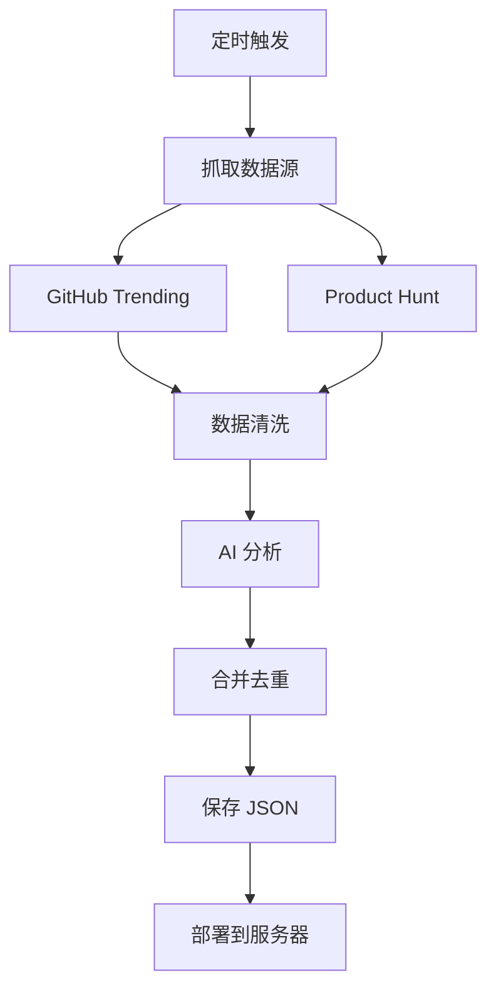

# AI Tools Auto-Updater

🤖 基于 AI Agent 的自动化工具收集与更新系统

## 🚀 功能特性

- **自动抓取**：从 GitHub Trending、Product Hunt 等多源收集 AI 工具
- **智能分析**：使用 DeepSeek LLM 分析工具功能、生成描述和标签
- **自动去重**：智能合并新旧数据，避免重复
- **定时更新**：每天自动运行，保持数据最新
- **一键部署**：自动部署到 1Panel 服务器

## 📁 项目结构

```
agents/
├── src/
│   ├── main.py           # 主入口
│   ├── models.py         # 数据模型定义
│   ├── deepseek.py       # DeepSeek API 集成
│   ├── agents.py         # CrewAI Agent 配置
│   └── scrapers.py       # 数据抓取器
├── data/
│   └── tools.json        # 工具数据存储
├── requirements.txt      # Python 依赖
└── .env.example          # 环境变量示例
```

## 🛠️ 安装与配置

### 1. 安装依赖

```bash
cd agents
python3 -m venv venv
source venv/bin/activate  # Windows: venv\Scripts\activate
pip install -r requirements.txt
```

### 2. 配置环境变量

```bash
cp .env.example .env
# 编辑 .env 文件，填入你的 API Key
```

必需配置：
- `DEEPSEEK_API_KEY`：DeepSeek API Key
- `SERVER_*`：服务器 SSH 连接信息

### 3. 测试运行

```bash
python -m src.main
```

## 📊 数据格式

工具数据遵循以下格式：

```json
{
  "id": "github-username-repo",
  "name": "Tool Name",
  "description": "Short description",
  "url": "https://...",
  "category": "AI写作",
  "tags": ["AI", "Tool", "Free"],
  "pricing": "free",
  "rating": 4.5,
  "popularity": 1000,
  "source": "github"
}
```

## 🔄 工作流程



## ⏰ 定时任务

系统通过 GitHub Actions 每天凌晨 0:00 自动运行：

```yaml
# .github/workflows/daily-update.yml
schedule:
  - cron: '0 0 * * *'
```

## 🧪 本地测试

```bash
# 测试数据抓取
python -m src.scrapers

# 测试 AI 分析
python -m src.deepseek

# 运行完整流程
python -m src.main
```

## 🤝 贡献

欢迎提交 Issue 和 Pull Request！

## 📝 License

MIT License
